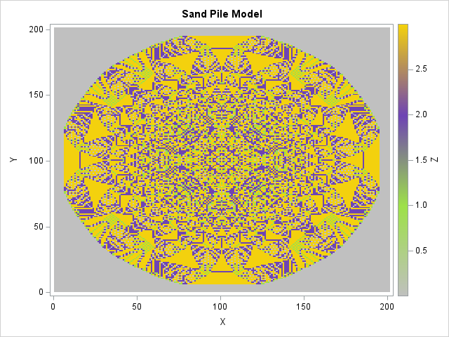

# 🏖️ Sand Pile Model

## 📌 Overview
The **Sand Pile Model** is a discrete dynamical system that demonstrates **self-organized criticality**. It simulates how grains of sand accumulate and topple, forming intricate fractal-like structures.

## ⚙️ Model Principle
- The simulation starts with a **grid** where all grains are added at the **center**.
- When a cell reaches **4 or more grains**, it topples, distributing grains to its **four neighbors**.
- The process continues until all cells have **fewer than 4 grains**.
- Grains that fall off the grid are **lost**.

## 🖥️ Implementation in SAS
- The grid is represented as a **matrix** using `PROC IML` in SAS.
- A **loop** finds unstable cells (≥4 grains) and redistributes the grains to their neighbors.
- The system runs until all cells **stabilize** (i.e., no cell has 4 or more grains).
- Once stable, the data is formatted into a **table for visualization**.

## 🎨 Visualization
- The **PROC SGPLOT** procedure with `HEATMAPPARM` is used to generate a heatmap of the final sand distribution.
- **Colors represent different grain levels** in the grid.

### 🎨 Color Scheme Used:
| Grain Count | Color |
|-------------|----------|
| Low grains | **Gray** (`#c0c0c0`) |
| Moderate grains | **Green** (`#9ee149`) |
| High grains | **Purple** (`#6e44b4`) |
| Maximum grains before toppling | **Yellow** (`#f3d10e`) |

## Result
The final image displays the self-organized structure of the sandpile after stabilization.

